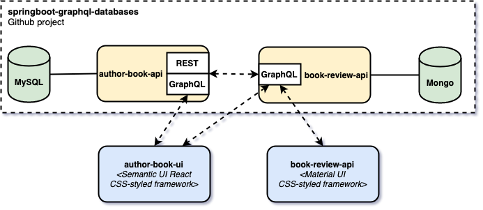

# `react-graphql-databases`

The goal of this project is to implement two **front-end (FE)** [`ReactJS`](https://reactjs.org/) applications, `author-book-ui` and `book-review-ui`. They will consume the [`GraphQL`](https://graphql.org/) endpoints of the two **back-end (BE)** applications present in the project [`springboot-graphql-databases`](https://github.com/ivangfr/springboot-graphql-databases), `author-book-api` and `book-review-api`.

## Microservices



### author-book-ui

ReactJS UI application where a **staff member** can manage authors and books and a **customer** can see the books and read/add book reviews and their rating. Its main BE application is `author-book-api` but all the reviews information are obtained from `book-review-api`. It uses [`Semantic UI React`](https://react.semantic-ui.com/) as CSS-styled framework.

### book-review-ui

ReactJS UI application where a **staff member** can manage books and a **customer** can see the books and read/add book reviews and their rating. Its BE application is `book-review-api`. It uses [`Material UI`](https://material-ui.com/) as CSS-styled framework. 

## Prerequisites

In order to run this project, you must have [`springboot-graphql-databases`](https://github.com/ivangfr/springboot-graphql-databases). So, follow the steps:

- In a terminal, run the command below to clone `springboot-graphql-databases` project
```
git clone https://github.com/ivangfr/springboot-graphql-databases.git
```

- Build `author-book-api` and `book-review-api` docker images as described at https://github.com/ivangfr/springboot-graphql-databases#build-docker-images

## Build Docker Images

### author-book-ui

In a terminal and inside `react-graphql-databases/author-book-ui`, run the following command
```
docker build -f Dockerfile -t docker.mycompany.com/author-book-ui:1.0.0 .
```

| Environment Variable   | Description                                                         |
| ---------------------- | ------------------------------------------------------------------- |
| `AUTHOR_BOOK_API_HOST` | Specify host of the `author-book-api` service (default `localhost`) |
| `AUTHOR_BOOK_API_PORT` | Specify port of the `author-book-api` service (default `8080`)      |
| `BOOK_REVIEW_API_HOST` | Specify host of the `book-review-api` service (default `localhost`) |
| `BOOK_REVIEW_API_PORT` | Specify port of the `book-review-api` service (default `9080`)      |

### book-review-ui

In a terminal and inside `react-graphql-databases/book-review-ui`, run the following command
```
docker build -f Dockerfile -t docker.mycompany.com/book-review-ui:1.0.0 .
```

| Environment Variable   | Description                                                         |
| ---------------------- | ------------------------------------------------------------------- |
| `BOOK_REVIEW_API_HOST` | Specify host of the `book-review-api` service (default `localhost`) |
| `BOOK_REVIEW_API_PORT` | Specify port of the `book-review-api` service (default `9080`)      |

## Start environment

In a terminal and inside `react-graphql-database` root folder run
```
docker-compose -f docker-compose.yml -f /PATH/TO/SPRINGBOOT_GRAPHQL_DATABASES/docker-compose.yml up -d
```

Wait a little bit until all services are up and healthy. You can check it by running
```
docker-compose -f docker-compose.yml -f /PATH/TO/SPRINGBOOT_GRAPHQL_DATABASES/docker-compose.yml ps
```

## Microservice Links

| Microservice     | URL                     |
| ---------------- | ----------------------- |
| `author-book-ui` | `http://localhost:8080` |
| `book-review-ui` | `http://localhost:9080` |

## Demo

TODO

## Running ReactJS apps with Npm

During development, it is better to just run the microservices instead of always build the docker images and run it. In order to do that, just run the docker-compose.yml file from the BE application. Then, run the FE applications with [`Npm`](https://www.npmjs.com/).

### author-book-ui

Open a new terminal and inside `react-graphql-databases/author-book-ui`, run the following command
```
npm start
```

### book-review-ui

Open a new terminal and inside `react-graphql-databases/book-review-ui`, run the following command
```
npm start
```

## Shutdown

To stop and remove containers, networks and volumes
```
docker-compose -f docker-compose.yml -f /PATH/TO/SPRINGBOOT_GRAPHQL_DATABASES/docker-compose.yml down -v
```

## TODO

- Add a GIF Demo

## References

- https://mherman.org/blog/dockerizing-a-react-app/
- https://www.freecodecamp.org/news/how-to-implement-runtime-environment-variables-with-create-react-app-docker-and-nginx-7f9d42a91d70/