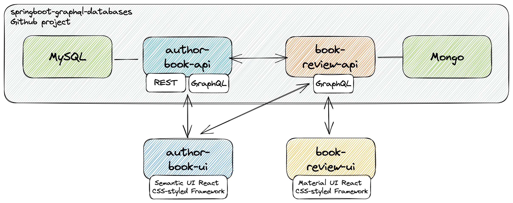

# react-graphql-databases

The goal of this project is to implement two **frontend** [`React`](https://react.dev) applications, `author-book-ui` and `book-review-ui`. They will consume the [`GraphQL`](https://graphql.org) endpoints of the two **backend** applications present in the project [`springboot-graphql-databases`](https://github.com/ivangfr/springboot-graphql-databases), `author-book-api` and `book-review-api`.

## Proof-of-Concepts & Articles

On [ivangfr.github.io](https://ivangfr.github.io), I have compiled my Proof-of-Concepts (PoCs) and articles. You can easily search for the technology you are interested in by using the filter. Who knows, perhaps I have already implemented a PoC or written an article about what you are looking for.

## Additional Readings

- \[**Medium**\] [**Implementing and Securing a Spring Boot GraphQL API with Keycloak**](https://medium.com/@ivangfr/implementing-and-securing-a-spring-boot-graphql-api-with-keycloak-c461c86e3972)
- \[**Medium**\] [**Implementing and Securing a Spring Boot GraphQL API with Okta**](https://medium.com/@ivangfr/implementing-and-securing-a-spring-boot-graphql-api-with-okta-78bc997359b4)

## Project Diagram



## Applications

- ### author-book-ui

  `React` UI application where **staff members** can manage authors and books and **customers** can see the books and read/add book reviews and their rating. Its main backend application is `author-book-api` but all the reviews information are obtained from `book-review-api`. It uses [`Semantic UI React`](https://react.semantic-ui.com) as CSS-styled framework.

- ### book-review-ui

  `React` UI application where **staff members** can manage books and **customers** can see the books and read/add book reviews and their rating. Its backend application is `book-review-api`. It uses [`Material UI`](https://material-ui.com) as CSS-styled framework. 

## Prerequisites

- [`npm`](https://docs.npmjs.com/downloading-and-installing-node-js-and-npm)
- [`springboot-graphql-databases`](https://github.com/ivangfr/springboot-graphql-databases)

  - In a terminal, run the command below to clone `springboot-graphql-databases` project:
    ```
    git clone https://github.com/ivangfr/springboot-graphql-databases.git
    ```

  - Build `author-book-api` and `book-review-api` docker images as described at https://github.com/ivangfr/springboot-graphql-databases#build-applications-docker-images.

## Run Applications with Npm

### Start Environment and Backend Applications

First, you need to start the environment and backend applications. For it, follow the instructions at [Start Environment](https://github.com/ivangfr/springboot-graphql-databases#start-environment) and [Running applications with Maven](https://github.com/ivangfr/springboot-graphql-databases#run-applications-with-maven).

### Start Applications

- **author-book-ui**

  - Open a new terminal and go to `react-graphql-databases/author-book-ui`;

  - Execute the command below if you are running `author-book-ui` for the first time:
    ```
    npm install
    ```

  - To start `author-book-ui` run:
    ```
    npm start
    ```

- **book-review-ui**

  - Open a new terminal and go to `react-graphql-databases/book-review-ui`.

  - Execute the command below if you are running `book-review-ui` for the first time:
    ```
    npm install
    ```

  - To start `book-review-ui` run:
    ```
    npm start
    ```

## Run Applications as Docker Containers

### Build Application's Docker Images

In a terminal and inside `react-graphql-databases` root folder, run the following script:
```
./build-docker-images.sh
```

### Application's environment variables

- **author-book-ui**

  | Environment Variable   | Description                                                         |
  | ---------------------- | ------------------------------------------------------------------- |
  | `AUTHOR_BOOK_API_HOST` | Specify host of the `author-book-api` service (default `localhost`) |
  | `AUTHOR_BOOK_API_PORT` | Specify port of the `author-book-api` service (default `8080`)      |
  | `BOOK_REVIEW_API_HOST` | Specify host of the `book-review-api` service (default `localhost`) |
  | `BOOK_REVIEW_API_PORT` | Specify port of the `book-review-api` service (default `9080`)      |

- **book-review-ui**

  | Environment Variable   | Description                                                         |
  | ---------------------- | ------------------------------------------------------------------- |
  | `BOOK_REVIEW_API_HOST` | Specify host of the `book-review-api` service (default `localhost`) |
  | `BOOK_REVIEW_API_PORT` | Specify port of the `book-review-api` service (default `9080`)      |

### Configure /etc/hosts

Add the line below to `/etc/hosts`:
```
127.0.0.1 author-book-api book-review-api
```

### Start Environment and Backend Applications

First, you need to start the environment and backend applications. For it, follow the instructions at [Start Environment](https://github.com/ivangfr/springboot-graphql-databases#start-environment) and [Running Applications as Docker containers](https://github.com/ivangfr/springboot-graphql-databases#run-applications-as-docker-containers).

### Start Applications

In a terminal and inside `react-graphql-databases` root folder, run following script:
```
./start-apps.sh
```

## Applications URLs

| Application    | URL                   |
| -------------- | --------------------- |
| author-book-ui | http://localhost:3000 |
| book-review-ui | http://localhost:3001 |

## Demo

- This gif shows a staff member adding a book using the wizard option. First, he looks for the author `josh long`. The search is looking for data at [**openlibrary.org**](https://openlibrary.org). Then, he picks the book `Getting Started With Roo`. As the author `Josh Long` is new to the application, he is created. The information of the book is already fulfilled based on the response from **openlibrary.org**. Finally, the application shows the preview of the book card, as the customer will see it. The checkbox is enabled in order to create the book also in `book-review-ui`.

  

- This another gif shows a customer adding a review about the book `Getting Started With Roo`. Once the review is submitted, it is already available for customer checking books in `author-book-ui` application.

  

## Shutdown

- To stop applications:

  - If they were started with `Npm`, go to the terminals where they are running and press `Ctrl+C`;

  - If they were started as a Docker container, go to a terminal and, inside `react-graphql-databases` root folder, run the script below:
    ```
    ./stop-apps.sh
    ```

- Finally, follow the shutdown steps for backend applications as described at [Shutdown](https://github.com/ivangfr/springboot-graphql-databases#shutdown)

## Cleanup

- To remove the Docker images created by this project, go to a terminal and, inside `react-graphql-databases` root folder, run the following script:
  ```
  ./remove-docker-images.sh
  ```

- Remove the line below from `/etc/hosts`:
  ```
  127.0.0.1 author-book-api book-review-api
  ```

## How to upgrade application's dependencies to latest version

- In a terminal, make sure you are inside `react-graphql-databases/author-book-ui` or `springboot-react-keycloak/book-review-ui` folder;

- Run the following commands:
  ```
  npm upgrade
  npm i -g npm-check-updates
  ncu -u
  npm install
  ```

## TODO

- Add confirmation dialog before deleting a book or a author.

## Issues

`book-review-ui` is still using **React 17** because it's depending on `material-ui` to support **React 18**. For more information see `material-ui` issue [#32074](https://github.com/mui/material-ui/issues/32074).

## References

- https://mherman.org/blog/dockerizing-a-react-app
- https://www.freecodecamp.org/news/how-to-implement-runtime-environment-variables-with-create-react-app-docker-and-nginx-7f9d42a91d70